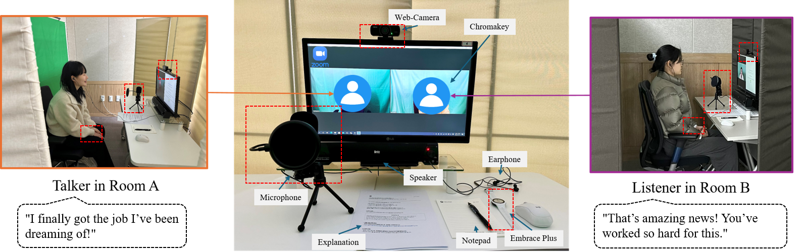
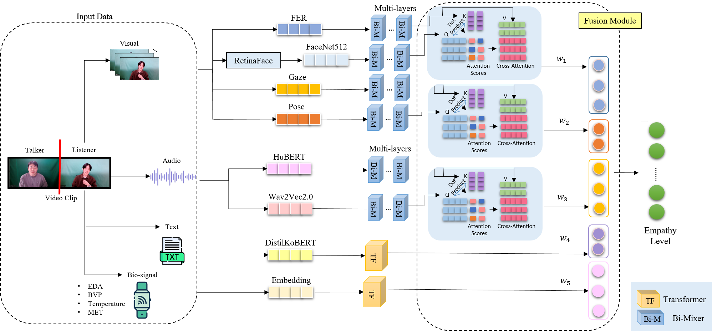

## Multi-modal online interaction EMPathy (Multi-EMP) Dataset



- **Participants**: 66 participants forming 33 pairs (male-male and female-female combinations)
- **Interaction Format**: Unscripted online video conversations with keyword prompts
- **Session Structure**: 
  - Four 10-minute conversation sessions (2-min preparation + 8-min conversation)
  - Participants alternating between talker and listener roles
  - Topics covering both positive and negative experiences
 
The dataset encompasses four primary modalities and features extracting code is provided:
1. **Visual**: 
 - Facial features (FaceNet512, Facial Emotion Recognition)
 - Pose (head nods, gestures, movements)
 - Gaze direction and pupil positions

2. **Audio**: 
   - HuBERT features
   - Wav2Vec2.0 features

3. **Text**: 
   - Transcribed conversation content
   - DistilKoBERT embeddings

4. **Bio-signals**:
   - Electrodermal Activity (EDA)
   - Blood Volume Pulse (BVP)
   - Temperature (TEMP)
   - Metabolic Equivalent of Task (MET)


  
## Dataset Access
To request access to the Multi-EMP dataset, please send an email to **218354@jnu.ac.kr** with the following:

Subject: "Multi-EMP Dataset Access Request"
Attach **EULA-Multi-EMP.pdf** describing your research purpose and how you plan to use the dataset
Include your affiliation and contact information

All requests will be reviewed, and access will be granted for academic and research purposes in accordance with our data usage policy.

Dataset page: https://sites.google.com/view/multi-emp?usp=sharing


## Empathy Measurement

The dataset provides two types of empathy measurements:

1. **Formula-based empathy level**:

   $$E_L = W_e \times (N_I - |I_t - I_l|)$$
   
   Where:
   - $E_L$: Empathy level
   - $W_e$: Weight assigned to the emotion (0.2, 0.5, or 1.0)
   - $N_I$: Intensity range
   - $I_t$, $I_l$: Intensity of talker's and listener's emotions

2. **Self-reported empathy level**:

   - 7-point Likert scale (from "strongly disagree" to "strongly agree")
   - Reflects listener's self-assessment of their empathy toward the talker


  
## Baseline Model Architecture


The model consists of two main components:

### 1. Bi-directional MLP-Mixer (Bi-Mixer)
We introduce the Bi-directional MLP-Mixer (Bi-Mixer) as a training module. The model handles multi-modal data by simultaneously processing forward and reverse contextual information. This approach captures the bidirectional nature of real-time interactions, improving empathy prediction accuracy.


### 2. Attention-Based Adaptive Weight Fusion
The fusion module integrates features from multiple modalities using a cross-attention mechanism and an adaptive weight. This approach allows the model to prioritize the most relevant modalities for empathy prediction across different contexts.


## Installation

Install dependencies using the provided `requirements.txt` file: 

```python
pip install -r requirements.txt
```

## Citation
TBA


## Acknowledgments
TBA


